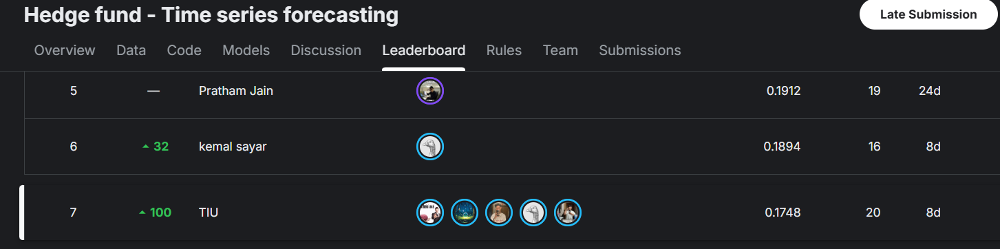

# Hedge Fund Time Series Forecasting — Kaggle Top 7 Solution

This repository documents Team **TIU**'s solution for the Kaggle competition  
**Hedge fund - Time series forecasting**.

The task is to forecast time-series targets across multiple financial identifiers and horizons.  
Our team reached **Rank #7** on the Kaggle leaderboard with a leaderboard score of **0.1748**.



> This project is a competition-grade time-series forecasting pipeline focused on leak-safe feature engineering, horizon-specific modeling, and robust LightGBM ensembling.

---

## Competition

**Competition:** [Hedge fund - Time series forecasting](https://www.kaggle.com/competitions/ts-forecasting)  
**Team:** TIU  
**Leaderboard:** Top 7  
**Domain:** Financial time-series forecasting  
**Main task:** Forecast by `code`, `sub_code`, `sub_category`, and forecast `horizon`.

The competition dataset is organized around grouped financial time series.  
Each row is associated with identifiers such as `code`, `sub_code`, `sub_category`, `ts_index`, and `horizon`, and the goal is to predict the target value for future timestamps.

---

## Repository Structure

```text
.
├── README.md
├── image.png
├── Hedge_Fund.pdf
├── ts_forecasting_report_v2.docx
├── SOLUTION+0.2003.ipynb
├── tiu-0-2544.ipynb
├── tiu-0-2544 (1).ipynb
├── tiu-0-2544 (2).ipynb
├── v41.ipynb
├── v49.ipynb
├── code-s-a-39.ipynb
├── notebook372a09c8db.ipynb
├── notebook372a09c8db-1.ipynb
└── notebook4023ecfff2.ipynb
```

### Main Files

| File | Description |
|---|---|
| `image.png` | Leaderboard screenshot showing Team TIU at rank #7. |
| `SOLUTION+0.2003.ipynb` | Main documented solution notebook with advanced feature engineering and per-horizon LightGBM training. |
| `v41.ipynb`, `v49.ipynb` | Later experiment versions used during model iteration. |
| `tiu-0-2544*.ipynb` | Team TIU experiment/submission notebooks. |
| `Hedge_Fund.pdf` | Project/report material. |
| `ts_forecasting_report_v2.docx` | Written report draft for the forecasting solution. |

---

## Solution Overview

The final approach uses a strong tabular time-series pipeline:

```text
Raw train/test parquet
        │
        ▼
Leak-safe preprocessing
        │
        ▼
Polars feature engineering
        │
        ├── lag features
        ├── rolling statistics
        ├── cross-sectional features
        ├── target encodings
        ├── DiffRoC features
        └── N-HiTS-inspired multi-rate features
        │
        ▼
Per-horizon LightGBM models
        │
        ▼
Multi-seed ensemble
        │
        ▼
Post-processing + submission.csv
```

The key idea is to treat each forecasting horizon as a separate learning problem while sharing a consistent feature engineering framework across horizons.

---

## Why Per-Horizon Models?

The competition contains multiple horizons:

```python
HORIZONS = [1, 3, 10, 25]
```

Short horizons and long horizons behave differently:

- `h=1` is more sensitive to short-term momentum and local changes.
- `h=3` balances recent movement and mid-range trend.
- `h=10` and `h=25` need smoother trend and multi-scale features.

Instead of training one global model, the solution trains separate models for each horizon.  
This makes validation more interpretable and allows each model to specialize in its own temporal behavior.

---

## Feature Engineering

The feature pipeline is implemented with **Polars** for speed and memory efficiency.

A representative run expands the data from roughly:

```text
6,784,521 rows × 95 columns
```

to more than:

```text
270 engineered columns
```

### 1. Leak-Safe Target Encoding

Target encoding is computed only from the training portion before the validation cutoff:

```python
VAL_THRESHOLD = 3500
```

Encodings are built for categorical groups such as:

- `sub_category`
- `sub_code`

This avoids leaking validation or test information into the training features.

---

### 2. Lag and Rolling Features

For major signal columns, the pipeline creates:

- lag features: `lag1`, `lag3`, `lag5`, `lag10`, `lag25`
- rolling means
- rolling standard deviations
- exponential moving averages
- within-timestamp rank features

These features capture both local temporal memory and cross-sectional relative strength.

---

### 3. Cross-Sectional Features

Financial time-series rows at the same timestamp are not independent.  
The solution adds cross-sectional normalization features such as:

```python
(feature - mean_at_ts_index) / std_at_ts_index
```

This helps the model understand whether a row is high or low relative to the rest of the market at the same time.

---

### 4. DiffRoC Features

The solution adds a set of difference and rate-of-change features:

- `diff3`
- `diff5`
- `roc5`
- `roc10`
- second-order acceleration

These features are useful when the raw value is less important than the recent direction, speed, and curvature of the signal.

---

### 5. N-HiTS-Inspired Multi-Rate Features

A major experiment in the repository adds **N-HiTS-style multi-rate decomposition** as tabular features.

Instead of using a neural N-HiTS model directly, the pipeline extracts N-HiTS-inspired features such as:

- rolling max pooling
- rolling average pooling
- multi-scale windows: `3`, `7`, `14`, `25`
- short-range interpolation residuals
- long-range interpolation residuals
- deviation from pooled signals

Example feature families:

```text
_nhits_maxp_3
_nhits_avgp_7
_nhits_interp_short
_nhits_interp_long
_nhits_resid_max7
_nhits_resid_avg14
```

This gives LightGBM access to hierarchical temporal structure without requiring a deep sequence model at inference time.

---

## Modeling

### Main Model

The strongest stable pipeline is based on **LightGBM regression**.

Representative configuration:

```python
LGB_PARAMS = {
    "objective": "regression",
    "metric": "rmse",
    "learning_rate": 0.015,
    "n_estimators": 5000,
    "num_leaves": 90,
    "min_child_samples": 200,
    "feature_fraction": 0.65,
    "bagging_fraction": 0.75,
    "bagging_freq": 5,
    "lambda_l1": 0.1,
    "lambda_l2": 10.0,
}
```

### Ensembling

The solution uses multiple random seeds:

```python
SEEDS = [42, 2024, 12345, 777, 9999]
```

Each horizon is trained with a multi-seed LightGBM ensemble.  
This improves stability and reduces leaderboard variance.

### Validation Strategy

The solution uses time-based validation rather than random splitting.

Core strategy:

1. Train on earlier timestamps.
2. Validate on later timestamps.
3. Select the best iteration count.
4. Retrain on the full available training data for each horizon.
5. Predict the test set.

This setup better matches the forward-looking nature of financial forecasting.

---

## Evaluation Metric

The local evaluation function in the notebooks follows a weighted normalized RMSE-style score:

```python
ratio = sum(weight * (y_true - y_pred)^2) / sum(weight * y_true^2)
score = sqrt(1 - clip(ratio, 0, 1))
```

This metric rewards predictions that reduce weighted error relative to the target magnitude.

---

## Representative Local Run

One documented experiment reports the following per-horizon validation scores:

| Horizon | Local score |
|---:|---:|
| 1 | 0.077978 |
| 3 | 0.125680 |
| 10 | 0.217417 |
| 25 | 0.262848 |

Representative aggregate local score:

```text
0.227254
```

These numbers are local validation values and should not be confused with the final Kaggle leaderboard score.

---

## Kaggle Result

Team **TIU** reached:

```text
Rank: 7
Leaderboard score: 0.1748
Submissions: 20
```

The leaderboard screenshot is included in this repository as `image.png`.

---

## How to Run

### 1. Install dependencies

```bash
pip install numpy pandas polars lightgbm scikit-learn matplotlib torch pytorch-tabnet
```

`pytorch-tabnet` is only needed for experiments.  
The core stable solution is LightGBM-based.

### 2. Prepare competition data

Expected Kaggle paths:

```text
/kaggle/input/competitions/ts-forecasting/train.parquet
/kaggle/input/competitions/ts-forecasting/test.parquet
```

For local execution, place the files as:

```text
train.parquet
test.parquet
```

### 3. Run the main notebook

Open:

```text
SOLUTION+0.2003.ipynb
```

Then run all cells to generate:

```text
submission.csv
```

---

## Output

The final output follows Kaggle's required submission format:

```csv
id,y_target
...
```

The notebook also generates diagnostic plots such as:

```text
diag1_scores.png
diag2_blend.png
diag3_residual.png
diag4_feature_imp.png
```

These plots are useful for checking horizon-level behavior, residual patterns, and feature importance.

---

## Key Takeaways

- Per-horizon modeling is more effective than a single global model.
- Leak-safe validation is essential in financial forecasting.
- Polars makes large-scale feature engineering practical.
- Cross-sectional features help capture market-relative behavior.
- N-HiTS-inspired pooling features improve long-horizon signal extraction.
- Multi-seed LightGBM ensembling is strong, stable, and leaderboard-friendly.

---

## Limitations

- The repository is notebook-based rather than packaged as reusable Python modules.
- Raw competition data is not included.
- Some notebooks are experimental and may contain duplicated code.
- TabNet experiments are included but were not the most stable final component.
- Reproducibility would improve with a clean `requirements.txt`, fixed seeds, and a single inference script.

---

## Future Improvements

- Refactor notebooks into `src/` modules.
- Add `requirements.txt`.
- Add a single `train.py` / `infer.py` pipeline.
- Save all experiment results to `results.json`.
- Add model comparison tables across versions.
- Add public/private leaderboard notes.
- Keep only the strongest notebooks and archive older experiments.

---

## Disclaimer

This repository is for educational and competition documentation purposes.  
It does not provide financial advice and should not be used for live trading or investment decisions.
